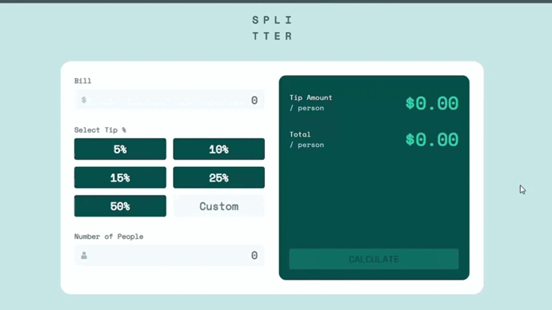

# Projeto | Tip Calculator App

### Desenvolvido como projeto de estudo.

### Focos de estudo: Javascript, SASS/SCSS, HTML e CSS.

Confira o resultado [clicando aqui](https://jeanwisotscki.github.io/calculator-challenge/) (Dica: control + click para abrir o link em uma nova guia. 😉)

# Preview do projeto

# Techs usadas no desenvolvimento

- JS
- SASS/SCSS
- HTML
- CSS
- GIT

# Desenvolvido por

- [@jeanwisotscki](https://github.com/jeanwisotscki/)
